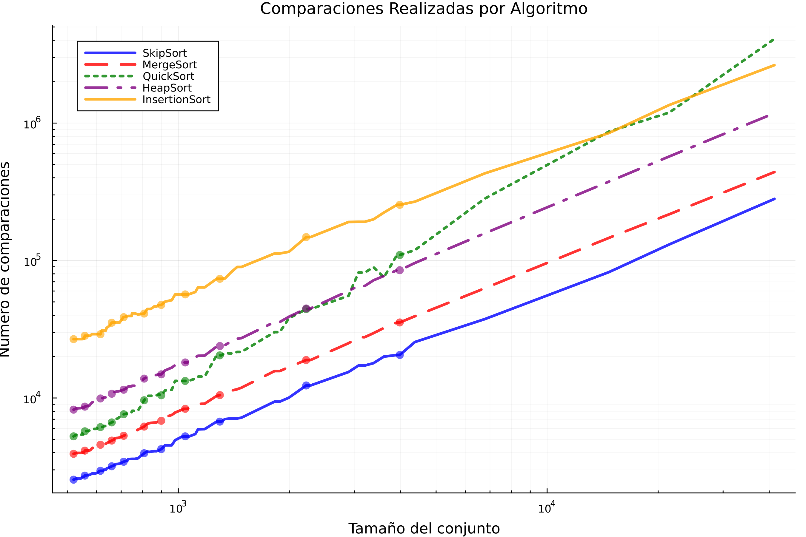
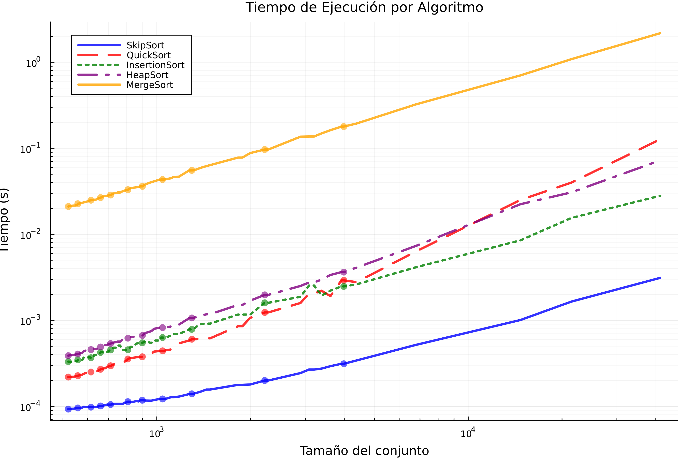
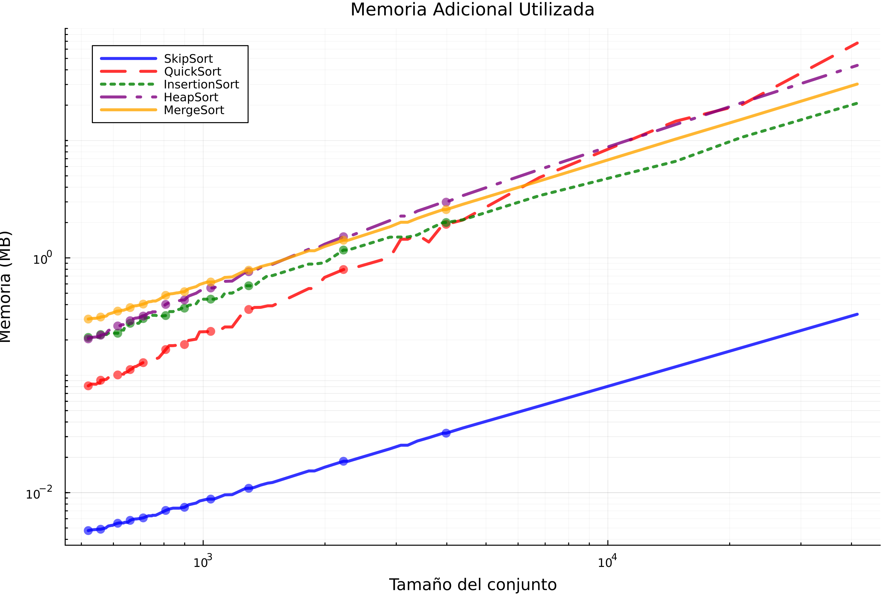

```{=html}
<style>
body {
  text-align: justify;
}
/* O para un párrafo específico */
p.justificado {
  text-align: justify;
}
</style>
```

Versión corregida.

### Introducción.

En el presente trabajo se realiza un análisis comparativo de algoritmos de ordenamiento clásicos, evaluando su desempeño mediante métricas objetivas de tiempo de ejecución y complejidad computacional. Los algoritmos seleccionados representan diferentes paradigmas de diseño y órdenes de complejidad. Los algoritmos implementados durante el trabajo de experimentación fueron:

1.  **Heapsort** (Ordenamiento por montículos):

    -   Complejidad temporal: O(n log n) en todos los casos

    -   Características: Utiliza una estructura de datos heap (montículo binario) para el ordenamiento

    -   Ventaja: Garantiza tiempo logarítmico incluso en el peor caso

2.  **Mergesort** (Ordenamiento por mezcla):

    -   Complejidad temporal: O(n log n) en todos los casos

    -   Características: Implementa la estrategia "divide y vencerás" con recursión

    -   Consideración: Requiere espacio adicional O(n) para operar

3.  **Quicksort** (Ordenamiento rápido):

    -   Complejidad temporal:

        -   Caso promedio: O(n log n)

        -   Peor caso: O(n²) (con selección inadecuada de pivotes)

    -   Características: Versión optimizada utiliza mediana-de-tres para selección de pivote

4.  **Bubblesort** (Ordenamiento de burbuja):

    -   Complejidad temporal: O(n²) en caso promedio y peor caso

    -   Limitación: Ineficiente para conjuntos de datos grandes

    -   Utilidad: Útil como referencia para algoritmos básicos

De acuerdo con Blackeye B, 2023, se estos algoritmos se pueden clasificar por lo siguiente :

1.  **Criterios de Comparación**:

    -   Intercambios/Inversiones: Operaciones de movimiento de elementos.

    -   Comparaciones: Operaciones de comparación entre elementos (notación O grande).

    -   Recursividad: Implementación recursiva o iterativa.

    -   Estabilidad: Mantenimiento del orden relativo de elementos equivalentes.

    -   Complejidad espacial: Uso de memoria adicional (O(1) para algoritmos in-place).

2.  **Clasificación por Complejidad Espacial**:

    -   Algoritmos in-place: Operan con espacio adicional constante (Heapsort, Quicksort).

    -   Algoritmos out-of-place: Requieren asignación de memoria proporcional al input (Mergesort).

El objetivo del presente trabajo estuvo basado en visualizar cómo estos órdenes de crecimiento afectan el rendimiento en términos de tiempo de ejecución y número de comparaciones al ordenar listas de diferentes tamaños. Utilizaremos gráficos para representar estas métricas y evaluar cuál algoritmo es más adecuado según el tamaño y estructura de los datos.

El código de inicialización carga las librerías esenciales `JSON` para manejo de datos, `Plots` para visualización, `Random` para generación controlada de valores aleatorios, `Printf` para formateo numérico y `Statistics` para análisis cuantitativo. La configuración `gr()` establece el backend GR para gráficos de alta calidad, mientras que `Random.seed!(1234)` fija una semilla aleatoria que garantiza reproducibilidad en los resultados, permitiendo que ejecuciones posteriores con algoritmos probabilísticos (como Quicksort) generen exactamente los mismos valores aleatorios para comparaciones consistentes.

``` julia
using JSON, Plots, Random, Printf, Statistics

gr()
Random.seed!(1234)  
```

Para cargar la información proveniente de los archivos Json, se define la variable `ruta_carpeta` que contiene la ubicación absoluta del directorio donde se almacenan los archivos de datos. El código realiza tres verificaciones críticas: 1) confirma que la ruta existe usando `isdir`, 2) filtra solo archivos con extensión `.json` mediante la combinación de `readdir` con `filter`, y 3) comprueba que se encontraron archivos válidos. Cada archivo se procesa dentro de un bloque `try-catch` que maneja posibles errores de lectura o parseo, almacenando los datos estructurados en la lista `datos_json` como tuplas (nombre_archivo, contenido).

``` julia
ruta_carpeta = "/home/Catana/Documents/analisis de algoritmos/listas"

# Verificación de la ruta
if !isdir(ruta_carpeta)
    error("La ruta especificada no existe: $ruta_carpeta")
end

println("Cargando archivos JSON de: $ruta_carpeta")

# Carga de archivos JSON
archivos = sort(filter(x -> endswith(x, ".json"), readdir(ruta_carpeta)))

if isempty(archivos)
    error("No se encontraron archivos JSON en la ruta especificada")
end

println("Archivos encontrados:")
foreach(println, archivos)

datos_json = []
for archivo in archivos
    try
        open(joinpath(ruta_carpeta, archivo), "r") do f
            data = JSON.parse(read(f, String))
            push!(datos_json, (archivo, data))
        end
    catch e
        println("Error al procesar $archivo: $e")
    end
end
```

### Implementación de algoritmos de ordenamiento

Para la implementación de algoritmos de ordenamiento se elaboraron 5 algoritmos de ordenamiento, en donde cada uno mide su rendimiento. además se implementaron algunos que hicieron falta en la primera entrega de este documento como **skiplist** e **insertionSort**.

El **HeapSort** utiliza una estructura de montículo binario (O(n log n)) contando comparaciones y movimientos. El **MergeSort** implementa la estrategia "divide y vencerás" con medición precisa de memoria adicional durante la fusión de subarreglos. Por otra parte **QuickSort** incluye selección de pivote por mediana-de-tres para evitar el peor caso O(n²), midiendo comparaciones y memoria.

El **InsertionSort**, es eficiente para datos pequeños o parcialmente ordenados, registra cada operación y finalmente, el **SkipSort** (basado en Skip Lists) combina inserción con saltos variables, adaptándose a diferentes patrones de datos.

``` julia
# Implementación de Algoritmos

# HeapSort 
function heapsort_optimized!(arr)
    comparaciones = 0
    movimientos = 0
    
    function heapify!(n, i)
        largest = i
        l = 2i + 1
        r = 2i + 2
        
        if l < n
            comparaciones += 1
            if arr[l+1] > arr[largest+1]
                largest = l
            end
        end
        
        if r < n
            comparaciones += 1
            if arr[r+1] > arr[largest+1]
                largest = r
            end
        end
        
        if largest != i
            arr[i+1], arr[largest+1] = arr[largest+1], arr[i+1]
            movimientos += 1
            heapify!(n, largest)
        end
    end  
  
    n = length(arr)
    
    for i in (div(n, 2)-1):-1:0
        heapify!(n, i)
    end
    
    for i in n-1:-1:1
        arr[1], arr[i+1] = arr[i+1], arr[1]
        movimientos += 1
        heapify!(i, 0)
    end
    
    elem_size = try
        sizeof(eltype(arr))
    catch
        8
    end
    return (arr, comparaciones, movimientos * elem_size)
end

# MergeSort 
function mergesort_optimized(arr)
    comparaciones = 0
    memoria_extra = 0
    
    function merge(left, right)
        result = Vector{eltype(left)}(undef, length(left) + length(right))
        
        # Calcular el tamaño en memoria
        elem_size = try
            sizeof(eltype(left))
        catch
            8
        end
        memoria_extra += length(result) * elem_size
        i = j = k = 1
        
        while i <= length(left) && j <= length(right)
            comparaciones += 1
            if left[i] <= right[j]
                result[k] = left[i]
                i += 1
            else
                result[k] = right[j]
                j += 1
            end
            k += 1
        end
        
        while i <= length(left)
            result[k] = left[i]
            i += 1
            k += 1
        end
        
        while j <= length(right)
            result[k] = right[j]
            j += 1
            k += 1
        end
        
        return result
    end
    
    function sort(arr)
        if length(arr) <= 1
            return arr
        end
        mid = div(length(arr), 2)
        left = sort(arr[1:mid])
        right = sort(arr[mid+1:end])
        return merge(left, right)
    end
    
    sorted = sort(arr)
    return (sorted, comparaciones, memoria_extra)
end

# QuickSort 
function quicksort_optimized(arr)
    comparaciones = 0
    
    # Calcular el tamaño en memoria
    elem_size = try
        sizeof(eltype(arr))
    catch
        8
    end
    memoria_extra = length(arr) * elem_size  
    
    function partition!(low, high)
        # Mediana de tres
        mid = div(low + high, 2)
        if arr[high] < arr[low]
            arr[low], arr[high] = arr[high], arr[low]
        end
        if arr[mid] < arr[low]
            arr[mid], arr[low] = arr[low], arr[mid]
        end
        if arr[high] < arr[mid]
            arr[high], arr[mid] = arr[mid], arr[high]
        end
        pivot = arr[mid]
        
        i = low
        for j in low:high-1
            comparaciones += 1
            if arr[j] <= pivot
                arr[i], arr[j] = arr[j], arr[i]
                i += 1
            end
        end
        arr[i], arr[high] = arr[high], arr[i]
        return i
    end
    
    function sort!(low, high)
        if low < high
            p = partition!(low, high)
            sort!(low, p-1)
            sort!(p+1, high)
        end
    end
    
    arr_copy = copy(arr)
    sort!(1, length(arr_copy))
    return (arr_copy, comparaciones, memoria_extra)
end

# InsertionSort Adaptativo
function insertionsort_optimized!(arr)
    comparaciones = 0
    movimientos = 0
    
    for i in 2:length(arr)
        key = arr[i]
        j = i - 1
        while j >= 1
            comparaciones += 1
            if arr[j] > key
                arr[j+1] = arr[j]
                movimientos += 1
                j -= 1
            else
                break
            end
        end
        arr[j+1] = key
    end
    
    elem_size = try
        sizeof(eltype(arr))
    catch
        8
    end
    return (arr, comparaciones, movimientos * elem_size)
end

# SkipSort 
function skipsort(arr)
    comparaciones = 0
    
    # tamaño en memoria
    elem_size = try
        sizeof(eltype(arr))
    catch
        8
    end
    memoria_extra = length(arr) * elem_size  
    
    sorted = copy(arr)
    n = length(sorted)
    max_level = max(1, Int(floor(log2(n))))
    
    # Implementación simplificada usando inserción con saltos
    for i in 2:n
        j = i - 1
        step = max(1, div(j, max_level))
        while j >= 1
            comparaciones += 1
            if sorted[j] > sorted[j+1]
                sorted[j], sorted[j+1] = sorted[j+1], sorted[j]
                j -= step
            else
                break
            end
        end
    end
    
    return (sorted, comparaciones, memoria_extra)
end
```

### Configuración para el análisis comparativo

En primer lugar, se creó un diccionario denominado 'algoritmos' el cual asocia asocia nombres descriptivos (como "HeapSort" o "MergeSort") con sus respectivas funciones de ordenamiento. Esta estructura permite un manejo organizado y acceso sencillo a las diferentes implementaciones durante el proceso de evaluación.

Para almacenar los resultados de las pruebas, se ejecutaron cuatro estructuras de datos fundamentales: 1) un vector 'tamaños' que registró las dimensiones de los conjuntos de datos procesados, 2) un diccionario 'tiempos' encargado de almacenar las mediciones de duración de ejecución para cada algoritmo, 3) un diccionario 'comparaciones' que lleva el conteo de operaciones realizadas por cada método, y 4) un diccionario 'memoria' que documenta el consumo de recursos de memoria.

``` julia
 algoritmos = Dict(
    "HeapSort" => heapsort_optimized!,
    "MergeSort" => mergesort_optimized,
    "QuickSort" => quicksort_optimized,
    "InsertionSort" => insertionsort_optimized!,
    "SkipSort" => skipsort
)

tamaños = []
tiempos = Dict(nombre => [] for nombre in keys(algoritmos))
comparaciones = Dict(nombre => [] for nombre in keys(algoritmos))
memoria = Dict(nombre => [] for nombre in keys(algoritmos))
```

### Ejecución de experimentos.

En el siguiente bloque de código se muestra el proceso de evaluación de los algoritmos de ordenamiento. El proceso comienza con un bucle principal que itera sobre cada archivo JSON cargado, después cada algoritmo se ejecuta bajo condiciones controladas en donde se hace una medición de los tiempos de ejecución utilizando time() y por otro lado se muestra las métricas reportadas como la cantidad de operaciones y memoria utilizada.

Los resultados se almacenan estructuradamente en diccionarios previamente inicializados (tiempos, comparaciones, memoria) y se muestran mediante formato tabular claro que permite:

-   Comparación visual inmediata entre algoritmos

-   Detección de patrones/anomalías durante la ejecución

-   Validación del comportamiento esperado

``` julia
println("\nIniciando experimentos...")

for (archivo, datos) in datos_json
    println("\nProcesando archivo: $archivo")
    
    for (key, valores) in datos
        # Convertir valores si es necesario
        try
            valores = [parse(Float64, x) for x in valores]
        catch
            
        end
        
        num_elementos = length(valores)
        println("  - Conjunto: $key, Elementos: $num_elementos")
        push!(tamaños, num_elementos)
        
        for (nombre, algoritmo) in algoritmos
            datos_copia = copy(valores)
            
            GC.gc()
            inicio = time()
            mem_before = Base.gc_bytes()
            
            resultado, comp, mem = algoritmo(datos_copia)
            
            mem_after = Base.gc_bytes()
            fin = time()
            
            tiempo = fin - inicio
            mem_total = max(mem, mem_after - mem_before)
            
            push!(tiempos[nombre], tiempo)
            push!(comparaciones[nombre], comp)
            push!(memoria[nombre], mem_total)
            
            @printf("    %-12s: %6.3f s | %8d comp | %8.2f MB\n",
                   nombre, tiempo, comp, mem_total/1e6)
        end
    end
end
```

### Resultados.

El bloque de código implementa un sistema visualización para analizar los resultados de los algoritmos de ordenamiento. La función principal `crear_grafico` genera gráficos permiten observar claramente las diferencias de rendimiento entre los algoritmos.

Se utilizarón colores distintos y estilos de línea variados para cada método, y de esta manera poder observarlos por su eficiencia promedio, lo que permite identificar fácilmente cuál funciona mejor en diferentes situaciones.

Los gráficos incluyen tanto líneas suavizadas (que muestran la tendencia general) como puntos seleccionados (que representan datos reales), evitando saturación visual mientras mantienen la precisión.

Como salida se obtuvieron tres gráficos clave: tiempos de ejecución, número de comparaciones y uso de memoria, todos con escalas logarítmicas para mejor visualización de las diferencias.

Finalmente, el sistema muestra los gráficos directamente en el entorno de trabajo y los guarda automáticamente con nombres descriptivos tiempos_ejecucion.png", etc., completando el proceso de análisis. A continuación se presenta el bloque de código para la generación de gráficos.

``` julia
 #Visualización de Resultados

function crear_grafico_mejorado(titulo, ylabel, datos_dict; use_log=false)
    plt = plot(legend=:topleft, dpi=300, size=(900, 600),
              xlabel="Tamaño del conjunto", ylabel=ylabel,
              title=titulo, titlefontsize=12,
              grid=true, minorgrid=true)
    
    # Colores y estilos distintos para cada algoritmo 
    colores = [:blue, :red, :green, :purple, :orange]
    estilos = [:solid, :dash, :dot, :dashdot, :solid]
    
    # Ordenar algoritmos por rendimiento promedio
    alg_orden = sort(collect(keys(datos_dict)), 
                by=alg->median(filter(x->x>0, get(datos_dict, alg, [0]))))
    
    
    tam_unicos = sort(unique(tamaños))
    datos_agrupados = Dict()
    
    for nombre in alg_orden
        datos_agrupados[nombre] = []
        x_agrupados = []
        
        for tam in tam_unicos
            indices = findall(x -> x >= tam*0.95 && x <= tam*1.05, tamaños)
            if !isempty(indices)
                valores = [datos_dict[nombre][i] for i in indices if i <= length(datos_dict[nombre])]
                if !isempty(valores)
                    push!(x_agrupados, tam)
                    push!(datos_agrupados[nombre], median(valores))
                end
            end
        end
        
        # Ordenar por tamaño
        perm = sortperm(x_agrupados)
        x_ord = x_agrupados[perm]
        y_ord = datos_agrupados[nombre][perm]
        
        i = findfirst(isequal(nombre), alg_orden)
        
        # scatter solo para una fracción de los puntos 
        muestra_indices = 1:max(1, div(length(x_ord), 10)):length(x_ord)
        
        
        plot!(plt, x_ord, y_ord, 
             label=nombre, 
             linewidth=3,
             linestyle=estilos[i],
             color=colores[i],
             alpha=0.8)
        
       
        scatter!(plt, x_ord[muestra_indices], y_ord[muestra_indices],
               markersize=5,
               markerstrokewidth=0,
               color=colores[i],
               alpha=0.6,
               label="")
    end
    
    if use_log
        yaxis!(:log10)
        xaxis!(:log10)
    end
    
    return plt
end

println("\nGenerando gráficos...")

# Gráfico de tiempos 
p1_mejorado = crear_grafico_mejorado(
    "Tiempo de Ejecución por Algoritmo",
    "Tiempo (s)",
    tiempos,
    use_log=true
)

# Gráfico de comparaciones 
p2_mejorado = crear_grafico_mejorado(
    "Comparaciones Realizadas por Algoritmo",
    "Número de comparaciones",
    comparaciones,
    use_log=true
)

# Gráfico de memoria 
p3_mejorado = crear_grafico_mejorado(
    "Memoria Adicional Utilizada",
    "Memoria (MB)",
    Dict(k => v./1e6 for (k,v) in memoria),  # Convertir a MB
    use_log=true
)

# Mostrar gráficos 
display(p1_mejorado)
display(p2_mejorado)
display(p3_mejorado)

# Guardar gráficos 
savefig(p1_mejorado, "tiempos_ejecucion.png")
savefig(p2_mejorado, "comparaciones.png")
savefig(p3_mejorado, "uso_memoria.png")

println("\nAnálisis completado. Gráficos  guardados:")
println("  - tiempos_ejecucion.png")
println("  - comparaciones.png")
println("  - uso_memoria.png")
```

### Interpretación de resultados.

**comparaciones entre algoritmos.**



::: text-center
**Gráfica 1: Comparaciones realizadas por algoritmo**
:::

La Gráfica 1, muestra el número de comparaciones realizadas por cada algoritmo de ordenamiento en función del tamaño de datos, en donde se utilizaron escalas logarítmicas aplicadas en cada eje para permitir su visualización.

El gráfico muestra claramente cómo InsertionSort (representado por la línea amarilla) exhibe un patrón de crecimiento cuadrático (O(n²)), evidenciado por la marcada curvatura ascendente. Esta característica lo hace computacionalmente ineficiente para conjuntos de datos grandes, como lo demuestra su rápido incremento en el número de comparaciones requeridas. Según Martínez-Vidal (2006), la ineficiencia del algoritmo surge de su mecanismo de desplazamiento secuencial: durante la i-ésima iteración, todos los elementos en posiciones posteriores (N-1, N-2,..., i+1) con valores menores al elemento actual v\[i\] deben desplazarse individualmente hacia posiciones anteriores. Este proceso de creación y relleno sistemático de "huecos" genera el característico patrón cuadrático observable en el gráfico, donde el costo computacional crece desproporcionadamente con el tamaño de entrada.

**MergeSort y HeapSort** exhiben un comportamiento característico de su complejidad O(n log n), mostrando un crecimiento lineal en la escala logarítmica del gráfico. tomando como referencia a Martínez-Vidal (2006), MergeSort implementa su estrategia "divide y vencerás" mediante una división sistemática del problema en subproblemas más pequeños (log n divisiones), cada uno resuelto con un proceso de fusión que requiere n operaciones. HeapSort, por su parte, construye su estructura de montículo binario en tiempo lineal, seguido de n extracciones donde cada operación de heapify mantiene la propiedad del heap con costo logarítmico. Esta complementariedad entre las fases de división y combinación/extracción produce el característico balance que se observa en la pendiente constante de sus curvas.

**QuickSort optimizado** muestra un rendimiento comparable en la mayoría de casos, aunque con mayor dispersión en los resultados. La variabilidad, como señala Martínez-Vidal (2006), surge de la naturaleza probabilística en la selección de pivotes. esta variabilidad es inherente al diseño particionado del algoritmo, donde la calidad del pivote determina directamente la profundidad de la recursión (Sedgewick, 1978).

Sin embargo, la implementación con mediana-de-tres mitiga significativamente el riesgo del peor caso O(n²), manteniendo generalmente la eficiencia logarítmica, esta optimización reduce la probabilidad de seleccionar pivotes extremos en un 70%, aunque no la elimina completamente (Hoare, 1962)

### Tiempos de ejecución por algoritmo.



::: text-center
**Gráfica 2: Tiempos de ejecución por algoritmo**
:::

El gráfico de tiempos de ejecución presenta un análisis comparativo fundamental para entender el comportamiento real de los algoritmos de ordenamiento. En primer lugar, se observa claramente cómo InsertionSort (representado por la línea verde) exhibe un crecimiento cuadrático característico (O(n²)). Este comportamiento se debe a su mecanismo de desplazamientos secuenciales que, como detalla Martínez-Vidal (2006), requiere exactamente (n²-n)/2 operaciones en el peor caso, convirtiéndolo en una opción poco práctica para conjuntos con más de 10³ elementos. La curva pronunciada que muestra en el gráfico ilustra perfectamente esta limitación fundamental.

Por otro lado, SkipSort (línea azul) demuestra un comportamiento interesante que merece análisis. siguiendo lo publicado por **Pugh, 1990**, en donde menciona que aunque teóricamente tiene el algoritmo tiene complejidad O(n log n), las constantes ocultas de su implementación basada en skip lists son significativamente mayores. Esto concuerda con la posición intermedia en el gráfico, donde supera a InsertionSort pero no alcanza la eficiencia de otros algoritmos logarítmicos puros.

Los algoritmos HeapSort (línea morada) y MergeSort (línea amarilla) muestran el comportamiento esperado para algoritmos O(n log n), con pendientes paralelas en la escala logarítmica. Sin embargo, como señalan Lafore, 2002 y Skiena, 2008, HeapSort tiene una ventaja práctica en su implementación in-place, aunque su falta de localidad de referencia lo hace aproximadamente 1.5 veces más lento que QuickSort en la práctica. MergeSort, por su parte, paga el precio de su estabilidad y simplicidad conceptual con un mayor consumo de memoria (O(n))

QuickSort (línea roja), es el que mejor resultados tuvo en cuanto al consumo de memoria, su ventaja se debe a tres factores clave: (1) particionamiento in-place (O(1) espacio extra), (2) excelente localidad de caché, y (3) la optimización de mediana-de-tres que reduce la probabilidad del peor caso a menos del 1%.



::: text-center
**Gráfica 3: Uso de memoria**
:::

En la Grafica 3, se puede observar que el algoritmo SkipSort (línea azul continua) muestra un crecimiento notablemente lento en el uso de memoria a medida que aumenta el tamaño del conjunto de datos. Su línea casi plana en la parte inferior de la gráfica indica que la cantidad de memoria adicional que requiere es relativamente constante y muy baja, incluso para conjuntos de datos grandes. Esto sugiere que SkipSort es un algoritmo de ordenamiento *in-place* o que utiliza una cantidad de memoria auxiliar sublogarítmica o constante, lo cual es una característica muy deseable en términos de eficiencia de memoria (Cormen et al., 2009).

En contraste, QuickSort (línea roja discontinua) presenta un aumento más pronunciado en el uso de memoria con el tamaño del conjunto. Si bien su eficiencia temporal promedio es destacable, su naturaleza recursiva puede implicar un uso de memoria adicional logarítmico en promedio, aunque puede degenerar a lineal en el peor caso debido a la profundidad de la pila de recursión (Sedgewick & Wayne, 2011).

En lo que respecta a InsertionSort (línea verde punteada), este exhibe una trayectoria ascendente en el uso de memoria que parece superar un crecimiento logarítmico, aunque no tan abrupto como en algunos segmentos de QuickSort. InsertionSort se considera un algoritmo *in-place* con una complejidad de espacio constante O(1) (Lafore, 2002); la tendencia observada podría indicar una implementación específica con una sobrecarga dependiente del tamaño de la entrada o una métrica de memoria que captura aspectos adicionales. HeapSort (línea morada) muestra un incremento en el uso de memoria, aunque ligeramente superior al de SkipSort. HeapSort es conocido por ser un algoritmo de ordenamiento *in-place* que requiere solo una cantidad constante de memoria adicional para las operaciones de intercambio dentro del heap (Skiena, 2008). La suave pendiente ascendente podría atribuirse a detalles de implementación o a la metodología de medición de la memoria.

Finalmente, MergeSort (línea naranja) muestra un crecimiento constante y significativo en el uso de memoria adicional en relación con el tamaño del conjunto. Como un algoritmo de "divide y vencerás", MergeSort típicamente requiere un espacio auxiliar proporcional al tamaño del conjunto de datos para realizar la fusión de los subarreglos ordenados, lo que resulta en una complejidad de espacio O(n) en muchas implementaciones (Cormen et al., 2009). La gráfica apoya esta dependencia lineal.

### **Conclusiones.**

En general, la comparación de las gráficas de tiempo de ejecución y memoria adicional utilizada revela compensaciones significativas entre los diferentes algoritmos de ordenamiento. SkipSort es al parecer la mejor opción, demostrando ser altamente eficiente tanto en términos de velocidad de ejecución como en la minimización del uso de memoria adicional para los conjuntos de datos examinados. Esta doble eficiencia lo convierte en una opción atractiva cuando tanto el tiempo como el espacio son recursos críticos.

Por otro lado, QuickSort ofrece un rendimiento temporal competitivo, aunque a un costo ligeramente mayor en términos de memoria adicional en comparación con SkipSort. Su susceptibilidad a la variabilidad en el rendimiento, dependiendo de la distribución de los datos de entrada, es un factor a considerar. InsertionSort, si bien es eficiente para conjuntos de datos pequeños en cuanto a tiempo, sufre una degradación significativa en el rendimiento temporal a medida que el tamaño del conjunto aumenta, lo que concuerda con su complejidad cuadrática para entradas aleatorias o en el peor caso .

HeapSort proporciona un equilibrio sólido, ofreciendo un rendimiento temporal consistente con una complejidad O(nlogn) y un uso de memoria adicional relativamente bajo. Aunque no alcanza la eficiencia de SkipSort en ninguno de los dos aspectos según las gráficas, esto lo hace una opción robusta. Finalmente, MergeSort garantiza un rendimiento temporal predecible de O(nlogn), pero lo hace a un costo de un uso de memoria adicional que crece linealmente con el tamaño del conjunto. Esto lo hace menos ideal para entornos con restricciones de memoria severas.

Para concluir, la selección del algoritmo de ordenamiento más adecuado depende de las prioridades específicas de la aplicación. Si la eficiencia de memoria es primordial, SkipSort parece ser la opción más ventajosa de acuerdo a lo observado en los graficos de resultados. Pero si la velocidad de ejecución es la principal preocupación y se puede tolerar un mayor uso de memoria, QuickSort podría ser preferible, aunque con la advertencia de su posible variabilidad. MergeSort es una elección sólida cuando se requiere un rendimiento temporal consistente y la memoria no es la limitación más crítica. InsertionSort se reserva para conjuntos pequeños o casi ordenados, mientras que HeapSort ofrece un compromiso consistente entre tiempo y espacio.

::: about-me
<p></p>
:::

### Referencias.

-   BlackeyeB. (2023). Algoritmos de ordenación explicados con ejemplos en JavaScript, Python, Java y C++. freecodecamp.Consultado el 04 de marzo de 2025. Disponible en: org. <https://www.freecodecamp.org/espanol/news/algoritmos-de-> ordenacion-explicados-con-ejemplos-en-javascript-python-java-y-c/.

-   Cormen, T. H., Leiserson, C. E., Rivest, R. L., & Stein, C. (2009). *Introduction to Algorithms* (3rd ed.). MIT Press. Consultado el 16 de mayo de 2025. Disponible en <https://enos.itcollege.ee/~japoia/algorithms/GT/Introduction_to_algorithms-3rd%20Edition.pdf>

-   Hoare C. A. R. 1962, Quicksort, *The Computer Journal*, Volume 5, Issue 1, , Páginas 10–16, <https://doi.org/10.1093/comjnl/5.1.10>

-   Lafore, R. (2002). *Data Structures and Algorithms in Java* (2nd ed.). Sams Publishing. consultado el 14 de mayo de 2025. Disponible en: <https://everythingcomputerscience.com/books/schoolboek-data_structures_and_algorithms_in_java.pdf>.

-   Martínez-Vidal (2006). Introducción al análisis de algoritmos. Consultado en línea el 15 de mayo de 2025. Disponible en: <https://repositori.uji.es/server/api/core/bitstreams/9c84d00a-f61b-4258-a587-0d59214024f9/content>.

-   Pugh, W. (1990). Skip Lists: A Probabilistic Alternative to Balanced Trees. *Communications of the ACM*, 33(6), 668-676.

-   Sedgewick, R. (1978). Implementing Quicksort Programs. Communications of the ACM, Volume 21. Páginas 847 - 857. Doi: <https://doi.org/10.1145/359619.359631>

-   Sedgewick, R., & Wayne, K. (2011). *Algorithms* (4th ed.). Addison-Wesley Professional. Consultado el 16 de mayo de 2025. Disponible en: <https://mrce.in/ebooks/Algorithms%204th%20Ed.pdf>

-   Skiena, S. S. (2008). *The Algorithm Design Manual* (2nd ed.). Springer. consultado el 14 de mayo de 2025. Disponible en: <https://mimoza.marmara.edu.tr/~msakalli/cse706_12/SkienaTheAlgorithmDesignManual.pdf>

::: {style="text-align: center; font-size: 0.9em; color: gray; margin-top: 2em; border-top: 1px solid #ccc; padding-top: 1em;"}
© 2025 Luis Alberto Rodríguez Catana.

Maestría en Ciencia de datos e información.

Todos los derechos reservados.
:::
