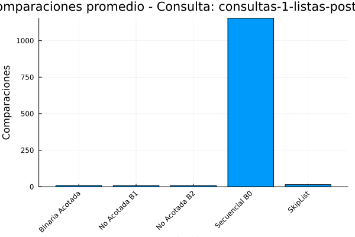
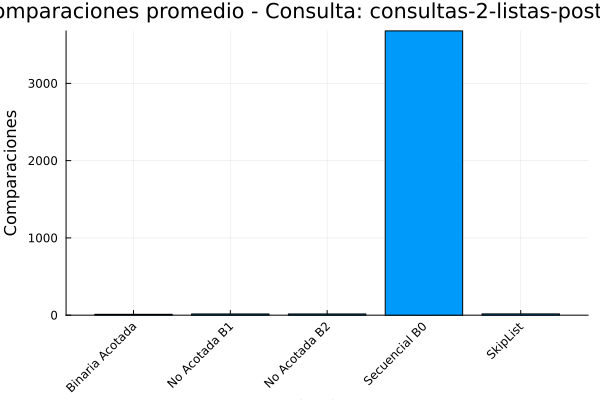
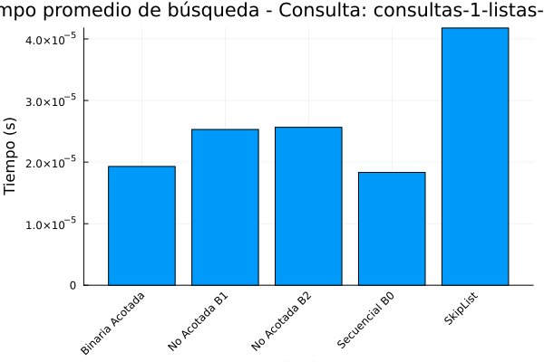
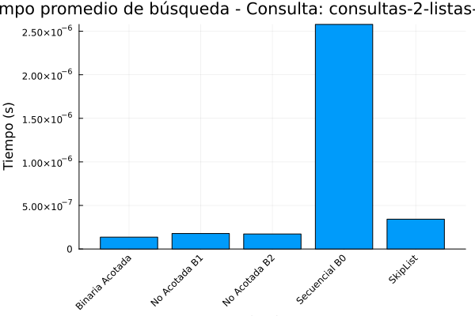
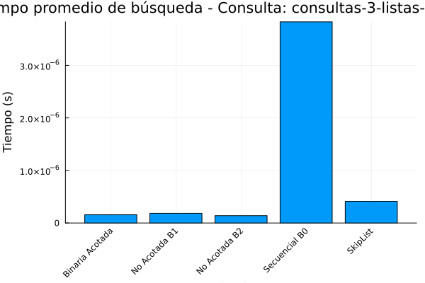
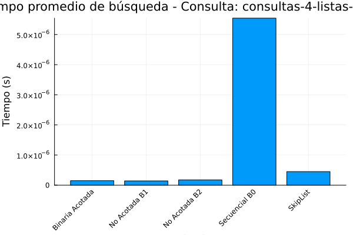

```{=html}
<style>
body {
  text-align: justify;
}
/* O para un párrafo específico */
p.justificado {
  text-align: justify;
}
</style>
```

Versión corregida

### Introducción.

El siguiente trabajo aborda los algoritmos de búsqueda por comparación vistos en clase los cuales son: búsqueda binaria acotada, búsqueda secuencial (Bo), búsqueda no acotada (B1), búsqueda no acotada (B2), y búsqueda mediante la estructura de datos SkipList.

Estos algoritmos son importantes debido a que toman un argumento y tratan de encontrarlo en un conjunto de datos, tablas o registos, para comprender mejor lo que es una búsqueda binaria secuencial, se consultaron diversos recursos como páginas web y documentos en PDF, en donde Chaves-Madrigal, 2020, explica que es conocida también como búsqueda lineal, y la lógica de funcionamiento consiste en buscar un elemento tomando como punto de partida la primera línea, si el elemento no se encuentra se sigue al siguiente ítem y así sucesivamente hasta llegar al final en la lista.

Las ventajas que proporciona la búsqueda binaria secuencial radica en que es funcional para conjuntos de datos no muy grandes y por otra parte su desventaja es que debe recorrer por completo todo el conjunto de datos. En lo que respecta a la búsqueda binaria de acuerdo con Emmita, 2017, este algoritmo lo que hace es repetidamente apuntar al centro de la estructura de búsqueda y dividir el espacio restante por la mitad, así hasta encontrar el valor buscado, de esta forma se ahorra tiempo de encontrar el elemento objetivo y no es necerario revisar cada uno de los elementos del conjunto de datos.

Respecto a Skiplist, Olivera, A. M., 2020, menciona que es una estructura de datos probabilística que utiliza múltiples niveles de listas enlazadas para lograr operaciones eficientes de búsqueda, estas listas funcionan de manera eficiente en las inserciones rápidas debido a que no hay rotaciones ni reasignaciones.

Este informe describe un script que inicialmente se elaboró para Python sin embargo se hizo el esfuerzo de adaptación a Julia, el codigo esta diseñado para analizar y comparar el rendimiento de varios algoritmos de búsqueda, incluyendo un Skip List y algoritmos de búsqueda secuencial y binaria. El objetivo principal del script es evaluar la eficiencia de estos algoritmos en términos de tiempo de ejecución y número de comparaciones realizadas al buscar elementos en conjuntos de datos.

El script está estructurado en varias secciones funcionales:

1.  **Estructura de Datos Skip List:** el cual implementa la estructura de datos Skip List, conocida por su eficiencia en operaciones de búsqueda, inserción y eliminación.

2.  **Algoritmos de Búsqueda:** en esta sección se definen funciones para diferentes algoritmos de búsqueda, incluyendo búsqueda binaria acotada, búsqueda secuencial (ordenada y no ordenada) y búsqueda no acotada.

3.  **Carga de Datos y Consultas:** funciones para cargar datos desde archivos JSON y consultas desde archivos JSON.

4.  **Ejecución de Algoritmos y Medición de Rendimiento:** Lógica para ejecutar los algoritmos de búsqueda en los datos cargados y medir el tiempo de ejecución y el número de comparaciones.

5.  **Generación de Resultados y Gráficos:** Funciones para generar un DataFrame con los resultados, guardarlos en un archivo CSV y generar gráficos comparativos del rendimiento de los algoritmos.

6.  **Función Principal:** Función que coordina la ejecución del script, cargando datos, ejecutando las búsquedas y generando los resultados.

### Estructura de datos skiplist.

Los Skip Lists son útiles en escenarios donde se requiere un equilibrio entre la velocidad de búsqueda y la complejidad de la implementación. A diferencia de los árboles binarios de búsqueda balanceados, que garantizan un rendimiento de búsqueda logarítmico pero implican una lógica de rebalanceo compleja, los Skip Lists ofrecen un rendimiento logarítmico *promedio* con una lógica de inserción y eliminación mucho más simple. Esta simplicidad facilita su implementación y reduce el riesgo de errores en el código. Para inicializar el código se utilizarón las siguientes librerías.

``` julia
using JSON
using Random
using DataFrames
using CSV
using Plots
using StatsBase
using CategoricalArrays  # Para manejo de datos categóricos
```

El código comienza definiendo la estructura de datos Skip List, que es una estructura de datos probabilística que permite realizar búsquedas en tiempo logarítmico, similar a los árboles binarios de búsqueda, pero con una implementación más sencilla (**Pugh, 1990**).

Se definen dos estructuras principales:

-   `SkipListNode`: Representa un nodo en el Skip List, conteniendo un valor y un vector `forward` que almacena punteros a los siguientes nodos en los diferentes niveles del Skip List.

-   `SkipList`: Representa la estructura Skip List en sí, conteniendo el nivel máximo, la probabilidad `p` utilizada para determinar los niveles de los nodos, el nivel actual del Skip List, un nodo `header` que actúa como punto de entrada a la lista, y un contador `comparisons` para almacenar el número de comparaciones realizadas durante las búsquedas.

``` julia
# Referencia: Bentley, J. L., & Yao, A. C. (1976). An almost optimal algorithm for unbounded searching.

# SKIP LIST
mutable struct SkipListNode
    value::Float64
    forward::Vector{Union{Nothing,SkipListNode}}
end

mutable struct SkipList
    max_level::Int
    p::Float64
    level::Int
    header::SkipListNode
    comparisons::Int

    function SkipList(max_level=16, p=0.5)
        header = SkipListNode(-Inf, Vector{Union{Nothing,SkipListNode}}(undef, max_level))
        fill!(header.forward, nothing)
        new(max_level, p, 1, header, 0)
    end
end

function random_level(sl::SkipList)
    lvl = 1
    while rand() < sl.p && lvl < sl.max_level
        lvl += 1
    end
    return lvl
end

function insert!(sl::SkipList, value::Float64)
    update = Vector{Union{Nothing,SkipListNode}}(undef, sl.max_level)
    fill!(update, nothing)
    x = sl.header

    for i in sl.level:-1:1
        while !isnothing(x.forward[i]) && x.forward[i].value < value
            sl.comparisons += 1
            x = x.forward[i]
        end
        update[i] = x
    end

    x = isnothing(x.forward[1]) ? nothing : x.forward[1]

    if isnothing(x) || x.value != value
        lvl = random_level(sl)
        if lvl > sl.level
            for i in sl.level+1:lvl
                update[i] = sl.header
            end
            sl.level = lvl
        end

        x_new = SkipListNode(value, Vector{Union{Nothing,SkipListNode}}(undef, lvl))
        fill!(x_new.forward, nothing)
        for i in 1:lvl
            x_new.forward[i] = update[i].forward[i]
            update[i].forward[i] = x_new
        end
    end
end

function search(sl::SkipList, value::Float64)
    sl.comparisons = 0
    x = sl.header
    for i in sl.level:-1:1
        while !isnothing(x.forward[i]) && x.forward[i].value < value
            sl.comparisons += 1
            x = x.forward[i]
        end
        sl.comparisons += 1
    end

    x = isnothing(x.forward[1]) ? nothing : x.forward[1]
    sl.comparisons += 1
    return (!isnothing(x) && x.value == value) ? (x, sl.comparisons) : (nothing, sl.comparisons)
end
```

A continuación se describen algunas implementaciones del Skip List en donde se incluye las siguientes funciones:

-   `SkipList(max_level=16, p=0.5)`: crea un nuevo Skip List con un nivel máximo y una probabilidad `p` dados.

-   `random_level(sl::SkipList)`: genera un nivel aleatorio para un nuevo nodo, basado en la probabilidad `p` del Skip List.

-   `insert!(sl::SkipList, value::Float64)`: inserta un nuevo nodo con el valor dado en el Skip List, actualizando los punteros `forward` de los nodos precedentes.

-   `search(sl::SkipList, value::Float64)`: busca un valor en el Skip List, devolviendo el nodo que contiene el valor (si se encuentra) y el número de comparaciones realizadas.

La eficiencia del Skip List se basa en la idea de mantener múltiples niveles de listas enlazadas, donde cada nivel actúa como una vía rápida para buscar elementos. La probabilidad `p` determina la proporción de nodos que pertenecen a cada nivel, afectando el equilibrio entre el costo de memoria y el rendimiento de la búsqueda (Pugh, 1990).

### Algoritmos de búsqueda.

La búsqueda binaria acotada es un algoritmo clásico (Cormen et al, 2022) eficiente para buscar un elemento en un arreglo ordenado cuando se conocen los límites inferior (`low`) y superior (`high`) del rango de búsqueda. Este algoritmo divide repetidamente el rango de búsqueda por la mitad, comparando el elemento central con el valor buscado y eliminando la mitad que no puede contener el valor. Su complejidad temporal es de O(log n), lo que lo hace muy rápido para grandes conjuntos de datos. Sin embargo, requiere que el arreglo esté ordenado y que se conozcan los límites del rango de búsqueda.

Se puede decir que es un algoritmo de búsqueda eficiente que funciona dividiendo repetidamente a la mitad la porción de la lista que podría contener el elemento, hasta encontrarlo o determinar que no está presente (Sadit, 2024).

La búsqueda secuencial tiene dos versiones. La versión `busqueda_secuencial_ordenada_B0(arr::Vector{Float64}, x::Float64)` está optimizada para arreglos ordenados. Recorre el arreglo elemento por elemento hasta encontrar el valor buscado o un valor mayor que él. En este último caso, se detiene la búsqueda, ya que el arreglo está ordenado y el valor buscado no puede estar más adelante. La versión `busqueda_secuencial_no_ordenada(arr::Vector{Float64}, x::Float64)` es la versión estándar para arreglos no ordenados. Recorre el arreglo completo elemento por elemento, comparando cada uno con el valor buscado. La búsqueda secuencial es simple de implementar y no requiere que el arreglo esté ordenado, pero su complejidad temporal es de O(n), lo que la hace ineficiente para grandes conjuntos de datos.

La búsqueda no acotada, implementada en las funciones `busqueda_no_acotada_B1(arr::Vector{Float64}, x::Float64)` y `busqueda_no_acotada_B2(arr::Vector{Float64}, x::Float64)`, está diseñada para buscar en arreglos donde el tamaño es desconocido o potencialmente infinito (Bentley y Yao, 1976).

Estos algoritmos primero buscan un rango donde es probable que se encuentre el valor buscado, expandiendo el rango exponencialmente. Luego, aplican la búsqueda binaria acotada en ese rango para localizar el valor exacto. La diferencia entre B1 y B2 radica en el manejo del primer elemento del arreglo.

La búsqueda no acotada puede manejar arreglos de tamaño desconocido, pero es más compleja de implementar que la búsqueda binaria o secuencial, y su rendimiento se ve afectado por la distribución de los datos.

``` julia
# Algoritmos de búsqueda
function busqueda_binaria_acotada(arr::Vector{Float64}, x::Float64, low::Int, high::Int)
    comparisons = 0
    while low <= high
        mid = (high + low) ÷ 2
        comparisons += 1
        if arr[mid] < x
            low = mid + 1
        elseif arr[mid] > x
            high = mid - 1
        else
            return mid, comparisons
        end
    end
    return -1, comparisons
end

function busqueda_secuencial_ordenada_B0(arr::Vector{Float64}, x::Float64)
    comparisons = 0
    for i in 1:length(arr)
        comparisons += 1
        if arr[i] == x
            return i, comparisons
        elseif arr[i] > x
            return -1, comparisons
        end
    end
    return -1, comparisons
end

function busqueda_secuencial_no_ordenada(arr::Vector{Float64}, x::Float64)
    comparisons = 0
    for i in 1:length(arr)
        comparisons += 1
        if arr[i] == x
            return i, comparisons
        end
    end
    return -1, comparisons
end

function busqueda_no_acotada_B1(arr::Vector{Float64}, x::Float64)
    comparisons = 0
    if isempty(arr)
        return -1, comparisons
    end

    bound = 1
    while bound <= length(arr) && arr[bound] < x
        comparisons += 1
        bound *= 2
    end
    low = bound ÷ 2
    high = min(bound, length(arr))
    if low == 0
        low = 1
    end
    result, comp = busqueda_binaria_acotada(arr, x, low, high)
    return result, comparisons + comp
end

function busqueda_no_acotada_B2(arr::Vector{Float64}, x::Float64)
    comparisons = 0
    if isempty(arr)
        return -1, comparisons
    end

    if arr[1] == x
        return 1, 1
    end

    pos = 1
    while pos <= length(arr) && arr[pos] < x
        comparisons += 1
        pos *= 2
    end
    low = pos ÷ 2
    high = min(pos, length(arr))
    if low == 0
        low = 1
    end
    result, comp = busqueda_binaria_acotada(arr, x, low, high)
    return result, comparisons + comp
end

function cargar_archivos_datos(directorio::String)
    datos = Dict{String,Vector{Float64}}()
    if !isdir(directorio)
        error("Directorio de datos no encontrado: $directorio")
        return datos
    end
    archivos = filter(f -> endswith(f, ".json"), readdir(directorio))
    for archivo in archivos
        ruta = joinpath(directorio, archivo)
        data = JSON.parsefile(ruta)
        if data isa Dict
            for (key, value) in data
                if value isa Vector
                    datos["$(archivo)_$(key)"] = filter(x -> x isa Real, value)
                end
            end
        elseif data isa Vector
            datos[archivo] = filter(x -> x isa Real, data)
        end
    end
    return datos
end
```

La elección del algoritmo de búsqueda apropiado depende de las características de los datos y los requisitos de la aplicación. Si los datos están ordenados y el tamaño es conocido, la búsqueda binaria es la mejor opción. Si los datos no están ordenados o el tamaño es desconocido, la búsqueda secuencial o no acotada pueden ser más apropiadas.

### Carga de Datos y Consultas.

Para cargar los archivos de consulta utilizados en el script, se utilizó `cargar_consultas(directorio::String)` y `cargar_consultas(directorio::String)` el primero permite cargar los datos desde un archivo Json que se encuentran alojados en un directorio determinado, el segundo busca archivos que contengan la cadena "consultas" en su nombre y asume que contienen un vector de números reales o un diccionario con una clave "consultas" y un vector de números reales como valor.

``` julia
function cargar_consultas(directorio::String)
    consultas_por_archivo = Dict{String,Vector{Float64}}()
    if !isdir(directorio)
        error("Directorio de consultas no encontrado: $directorio")
        return consultas_por_archivo
    end
    for filename in readdir(directorio)
        if occursin("consultas", lowercase(filename)) && endswith(filename, ".json")
            filepath = joinpath(directorio, filename)
            data = JSON.parsefile(filepath)
            if data isa Dict && haskey(data, "consultas")
                consultas_por_archivo[filename] = data["consultas"]
            elseif data isa Vector
                consultas_por_archivo[filename] = data
            end
        end
    end
    return consultas_por_archivo
end
```

### Ejecución de Algoritmos y Medición de Rendimiento.

La función `main` coordina la ejecución de los algoritmos de búsqueda y mide su rendimiento. Para cada conjunto de datos cargado y cada conjunto de consultas cargado, la función itera sobre las consultas y ejecuta cada algoritmo de búsqueda en los datos, midiendo el tiempo de ejecución y el número de comparaciones realizadas. Los resultados se almacenan en un vector de tuplas.

### Gráficos.

Para poder almacenar los datos generados de la salida del codigo, se emplean un DataFrame el cual se exporta en un archivo .csv, y se generan los gráficos comparativos del rendimiento de los algoritmos.

Para generar los gŕaficos se utilizó `generar_graficos(df::DataFrame, output_dir::String)`, la salida es una gráfico de barras en el cual se compara el tiempo de ejecución y el número de comparaciones de los algoritmos para cada uno de los archivos de consulta, la implementación se muestra a continuación:

``` julia
function generar_graficos(df::DataFrame, output_dir::String)
    df.Algoritmo = categorical(df.Algoritmo)

    for archivo_consulta in unique(df.Archivo_Consulta)
        subset_df = filter(row -> row.Archivo_Consulta == archivo_consulta, df)

        group_alg = groupby(subset_df, :Algoritmo)
        resumen = combine(group_alg, [:Tiempo_s => mean, :Comparaciones => mean])

        # Suponiendo que quieres graficar Tiempo vs Algoritmo y Comparaciones vs Algoritmo
        p1 = bar(resumen.Algoritmo, resumen.Tiempo_s_mean,
                title="Tiempo promedio de búsqueda - Consulta: $archivo_consulta",
                ylabel="Tiempo (s)", xlabel="Algoritmo", xrotation=45, legend=false)
        savefig(joinpath(output_dir, "tiempo_$archivo_consulta.png"))

        p2 = bar(resumen.Algoritmo, resumen.Comparaciones_mean,
                title="Comparaciones promedio - Consulta: $archivo_consulta",
                ylabel="Comparaciones", xlabel="Algoritmo", xrotation=45, legend=false)
        savefig(joinpath(output_dir, "comparaciones_$archivo_consulta.png"))
    end

    # Resumen general de los algoritmos
    resumen_general = combine(groupby(df, :Algoritmo), [
        :Tiempo_s => mean => :Tiempo_promedio,
        :Comparaciones => mean => :Comparaciones_promedio,
        :Encontrado => sum => :Total_Encontrados
    ])

    println("\nResumen General de Resultados:")
    println(resumen_general)
end
```

### Función main

La función `main(ruta_base::String)`, toma como argumento la ruta base del directorio que contiene los archivos de datos y consultas. La función realiza las siguientes operaciones:

1.  Carga los datos y las consultas utilizando las funciones `cargar_archivos_datos` y `cargar_consultas`.

2.  Itera sobre los conjuntos de datos y las consultas cargados.

3.  Para cada combinación de conjunto de datos y consulta, itera sobre los algoritmos de búsqueda definidos.

4.  Ejecuta cada algoritmo de búsqueda en los datos y la consulta dados, midiendo el tiempo de ejecución y el número de comparaciones.

5.  Almacena los resultados en un vector.

6.  Crea un DataFrame a partir de los resultados y lo guarda en un archivo CSV.

7.  Genera gráficos comparativos del rendimiento de los algoritmos utilizando la función `generar_graficos`.

``` julia
function main(ruta_base::String)
    dir_datos = ruta_base
    dir_consultas = ruta_base

    datos_sin_ordenar = cargar_archivos_datos(dir_datos)
    consultas_por_archivo = cargar_consultas(dir_consultas)

    if isempty(datos_sin_ordenar) || isempty(consultas_por_archivo)
        println("No se encontraron archivos de datos o consultas necesarios.  Verifique las rutas.")
        return
    end

    resultados = []

    for (nombre_archivo_datos, datos) in datos_sin_ordenar
        datos_ordenados = sort(datos)
        sl = SkipList()
        for num in datos
            insert!(sl, num)
        end

        for (nombre_archivo_consulta, consultas) in consultas_por_archivo
            for consulta in consultas[1:min(100, length(consultas))]
                for (nombre_algoritmo, algoritmo) in [
                    ("Binaria Acotada", (arr, x) -> busqueda_binaria_acotada(arr, x, 1, length(arr))),
                    ("Secuencial B0", busqueda_secuencial_ordenada_B0),
                    ("No Acotada B1", busqueda_no_acotada_B1),
                    ("No Acotada B2", busqueda_no_acotada_B2),
                    ("SkipList", (arr, x) -> search(sl, x))
                ]
                    try
                        start_time = time()
                        if nombre_algoritmo == "SkipList"
                            resultado, comp = algoritmo(datos, consulta)
                        else
                            resultado, comp = algoritmo(datos_ordenados, consulta)
                        end
                        tiempo = time() - start_time

                        push!(resultados, (
                            Archivo_Datos=nombre_archivo_datos,
                            Archivo_Consulta=nombre_archivo_consulta,
                            Consulta=consulta,
                            Algoritmo=nombre_algoritmo,
                            Tiempo_s=tiempo,
                            Comparaciones=comp,
                            Encontrado=resultado != -1 && !isnothing(resultado)
                        ))
                    catch
                        open("errores.log", "a") do f
                            println(f, "Error en $nombre_algoritmo con consulta $consulta")
                       end
                    end
                end
            end
        end
    end

    df = DataFrame(resultados)
    CSV.write("resultados_busqueda.csv", df)
    println("Resultados guardados en: resultados_busqueda.csv")

    generar_graficos(df, ".")
end

ruta_base = "/home/Catana/Documents/analisis de algoritmos/listas/tarea 2"
if isabspath(ruta_base)
    main(ruta_base)
else
    println("La ruta proporcionada no es una ruta absoluta válida.")
end
```

La función `main` también maneja posibles errores, como la no existencia de los directorios de datos o consultas, e imprime mensajes informativos en caso de error.

### Resultados.

A continuación, se presenta un resumen de los resultados obtenidos al comparar el rendimiento de los diferentes algoritmos de búsqueda:

``` julia
Resumen General de Resultados:
5×4 DataFrame
 Row │ Algoritmo        Tiempo_promedio  Comparaciones_promedio  Total_Encontrados 
     │ Cat…             Float64          Float64                 Int64             
─────┼─────────────────────────────────────────────────────────────────────────────
   1 │ Binaria Acotada       4.06325e-6                 11.55                  752
   2 │ No Acotada B1         5.09083e-6                 17.3919                752
   3 │ No Acotada B2         5.40823e-6                 17.3919                752
   4 │ Secuencial B0         7.19681e-6               4894.74                  752
   5 │ SkipList              8.91283e-6                 16.8381                752
```

### Comparaciones y tiempos de ejecución.

De acuerdo con la salida anterior se puede observar que la búsqueda binaria acotada, tiene un rendimiento optimo en lo que respecta los tiempos de ejecución 4.06325e-6 segundos y el menor número de comparaciones promedio (11.55).

Esto demuestra la eficiencia teórica de la búsqueda binaria en arreglos ordenados, como lo menciona Cormen et al, 2022. Es el algoritmo más eficiente en este conjunto de datos, pero requiere que los datos estén ordenados, lo cual no siempre es el caso en aplicaciones del mundo real.

En lo que respecta a la búsqueda no acotada (B1 y B2), su rendimiento es ligeramente peor que la búsqueda binaria acotada en términos de tiempo de ejecución (alrededor de 5e-6 segundos) y realizan más comparaciones (alrededor de 17). Esto se debe a la sobrecarga adicional de encontrar el rango de búsqueda en arreglos no acotados, como se explica en Bentley y Yao (1976).

La diferencia de rendimiento entre B1 y B2 es mínima, lo que sugiere que el manejo del primer elemento del arreglo no tiene un impacto significativo en este conjunto de datos.

De acuerdo con la tabla de salida de resultados la búsqueda secuencial (B0) es el menos eficiente, con el mayor tiempo de ejecución (7.19681e-6 segundos) y, con diferencia, el mayor número de comparaciones promedio (4894.74). Esto ocurre debido a la complejidad temporal de O(n), lo que significa que el tiempo de ejecución aumenta linealmente con el tamaño de los datos. para finalizar el analisis de la tabla se observa que el Skip List se sitúa en un punto intermedio.

Aunque no es tan rápido como la búsqueda binaria acotada, su tiempo de ejecución (8.91283e-6 segundos) es competitivo con los algoritmos de búsqueda no acotada. Además, el número de comparaciones promedio (16.8381) es similar al de los algoritmos no acotados y significativamente mejor que la búsqueda secuencial. Esto demuestra la eficacia de los Skip Lists para lograr un buen equilibrio entre el rendimiento de la búsqueda y la complejidad de la implementación, como se describe en Pugh (1990). Los Skip Lists ofrecen una alternativa viable a los árboles de búsqueda balanceados, especialmente cuando la simplicidad de la implementación es una prioridad.

Las graficas de comparaciones y tiempos de ejecución para cada archivo de consulta se muestran de la Gráfica 1 a la Gráfica 8



::: text-center
**Gráfica 1: Comparaciones consultas-1-listas de posteo.**
:::



::: text-center
**Gráfica 2: Comparaciones consultas-2-listas de posteo.**
:::


:::: text-center
::: text-center
**Gráfica 3: Comparaciones consultas-3-listas de posteo.**
:::
::::


:::: text-center
::: text-center
**Gráfica 4: Comparaciones consultas-4-listas de posteo.**
:::
::::



::: text-center
**Gráfica 5: Tiempo de ejecución consultas-1-listas de posteo.**
:::



::: text-center
**Gráfica 6: Tiempo de ejecución consultas-2-listas de posteo.**
:::



::: text-center
**Gráfica 7: Tiempo de ejecución consultas-3-listas de posteo.**
:::



::: text-center
**Gráfica 8: Tiempo de ejecución consultas-4-listas de posteo.**
:::

### Conclusión.

La elección del algoritmo de búsqueda óptimo depende de los requisitos específicos de la aplicación. Si la eficiencia es primordial y los datos están ordenados con límites conocidos, la búsqueda binaria acotada sigue la mejor opción. Cuando el tamaño de los datos es desconocido, los algoritmos de búsqueda no acotada proporcionan una alternativa sólida.

Al comparar los gráficos, se pueden observar las siguientes compensaciones entre los algoritmos:

-   **SkipSort** es un algoritmo más eficiente tanto en términos de tiempo de ejecución como de uso de memoria adicional para los conjuntos de datos evaluados.

-   **QuickSort** ofrece buen rendimiento en tiempo, pero con un mayor uso de memoria adicional en comparación con SkipSort. Su rendimiento puede ser variable dependiendo de los datos de entrada.

-   **InsertionSort** es eficiente para conjuntos pequeños en términos de tiempo, pero su rendimiento se degrada rápidamente con conjuntos más grandes.

-   **HeapSort** proporciona un rendimiento de tiempo consistente y un uso de memoria adicional relativamente bajo, aunque no tan óptimo como SkipSort en ninguno de los dos aspectos de acuerdo con lo observado en las gráficas.

-   **MergeSort** garantiza una complejidad temporal O(nlogn) consistente, pero a costa de un uso de memoria adicional linealmente dependiente del tamaño del conjunto.

Finalmente, el Skip List ofrece un equilibrio entre el rendimiento de la búsqueda y la simplicidad de la implementación, lo que lo convierte en una opción versátil para una variedad de aplicaciones.

### Referencias.

-   Bentley, J. L., & Yao, A. C. (1976). An almost optimal algorithm for unbounded searching. *Information Processing Letters*, *5*(3), 82-87.

-   Chaves, A. W. M. (2025). ALGORITMOS DE RESOLUCIÓN DE PROBLEMAS. Usam.Ac.Cr. Consultado el 27 de marzo y recuperado de <https://repositorio.usam.ac.cr/xmlui/bitstream/handle/11506/2052/LEC%20ING%20SIST%200020%202020> sequence=1&isAllowed=y.

-   Cormen, T. H., Leiserson, C. E., Rivest, R. L., & Stein, C. (2022). *Introduction to algorithms*. MIT press.

-   Emmita. (2017). Búsqueda binaria. Medium. Consultado el 26 de marzo y recuperado de <https://medium.com/>@Emmitta/b%C3%BAsqueda-binaria-c6187323cd72

-   Olivera, A. M. (2020). Algoritmos de Búsqueda y Ordenamiento - Andrés Mise Olivera. Medium. Consultado el 31 de marzo y recuperado de [https://medium.com/\@mise/algoritmos-de- b%C3%BAsqueda-y-ordenamiento-7116bcea03d0](https://medium.com/)

-   Pugh, W. (1990). Skip lists: a probabilistic alternative to balanced trees. *Communications of the ACM*, *33*(6), 668-676.

-   Sadit, (s.f.). ALGO-IR. Recuperado de <https://sadit.github.io/ALGO-IR/>

::: {#footer style="text-align: center; font-size: 0.9em; color: gray; margin-top: 2em; border-top: 1px solid #ccc; padding-top: 1em;"}
© 2025 Luis Alberto Rodríguez Catana.

Maestría en Ciencia de datos e información.

Todos los derechos reservados.
:::
